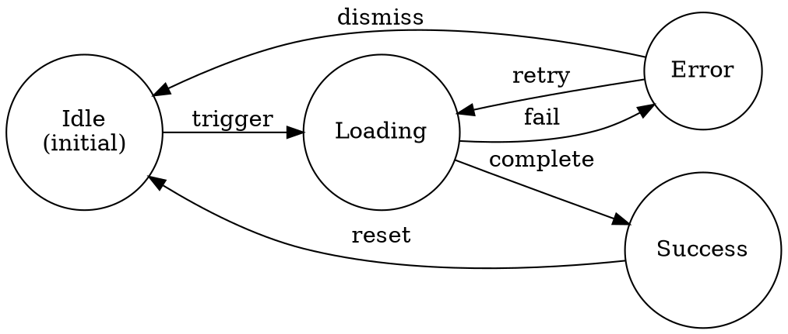

# Part I: Analysis Phase

## 1. Requirements Definition

**Before touching code, define what "correct" means.**

### 1.1 User Story Format

```
As a [role],
I want to [action],
So that [benefit].

Acceptance Criteria:
- Given [precondition], when [action], then [expected result]
- Given [precondition], when [action], then [expected result]
```

### 1.2 Gherkin Specification

```gherkin
Feature: [Feature Name]
  As a [role]
  I want [capability]
  So that [benefit]

  Background:
    Given [common preconditions]

  @critical @happy-path
  Scenario: Successful operation
    Given [specific preconditions]
    When [user action]
    Then [expected outcome]
    And [additional verification]

  @critical @error-handling
  Scenario: Operation fails gracefully
    Given [failure preconditions]
    When [user action]
    Then [error handling behavior]
    And [system remains stable]

  @edge-case
  Scenario: Boundary condition handling
    Given [boundary preconditions]
    When [user action]
    Then [boundary behavior]
```

### 1.3 Acceptance Criteria Checklist

| Category | Questions to Answer |
|----------|---------------------|
| **Functionality** | What should happen? What should NOT happen? |
| **Performance** | Response time requirements? Throughput limits? |
| **Security** | Authentication required? Authorization checks? |
| **Usability** | Error messages clear? Recovery path available? |
| **Compatibility** | Browser/device support? API versioning? |
| **Data Integrity** | Validation rules? Consistency requirements? |

---

## 2. Code Change Tracking

**Know exactly what changed before testing.**

### 2.1 Change Classification

| Change Type | Test Impact | Strategy |
|-------------|-------------|----------|
| **New Function** | New test cases needed | Full coverage of new code |
| **Modified Function** | Existing + new tests | Regression + new behavior |
| **Refactored Code** | Behavior verification | Before/after comparison |
| **Deleted Code** | Remove obsolete tests | Verify no dependencies |
| **Configuration** | Environment testing | Multi-environment validation |

### 2.2 Change Log Template

```markdown
## Change Summary

### Files Modified
| File | Type | Impact | Complexity |
|------|------|--------|:----------:|
| `path/to/file.ts` | Modified | High | ●●●○○ |

### Functions Changed
| Function | Change | Lines | Branches Added |
|----------|--------|:-----:|:--------------:|
| `functionName()` | Modified | 45-89 | +3 |

### Dependencies Affected
- Component A depends on modified function
- Service B calls refactored code
```

### 2.3 Complexity Scoring

```
●○○○○ (1) - Simple: Linear logic, no branches
●●○○○ (2) - Low: 1-2 branches, straightforward
●●●○○ (3) - Medium: 3-5 branches, some edge cases
●●●●○ (4) - High: 6-10 branches, complex logic
●●●●● (5) - Critical: 10+ branches, intricate state
```

---

## 3. State Machine Analysis

**Every UI is a state machine. Map all states and transitions.**

### 3.1 State Diagram Template



### 3.2 State Transition Matrix

```markdown
| Current State | Event | Next State | Side Effects | Guards |
|---------------|-------|------------|--------------|--------|
| idle | submit | loading | show spinner | input valid |
| idle | submit | idle | show error | input invalid |
| loading | success | success | hide spinner | - |
| loading | failure | error | hide spinner | - |
| loading | timeout | error | show timeout msg | - |
| error | retry | loading | clear error | - |
| error | dismiss | idle | clear error | - |
```

### 3.3 Invalid Transitions (Must Reject)

| Current State | Invalid Event | Expected Behavior |
|---------------|---------------|-------------------|
| loading | submit | Ignore (button disabled) |
| loading | navigate away | Warn or cancel |
| error | auto-retry | No retry without user consent |

---

## 4. Branch Mapping

**The CORE artifact. Map ALL code paths systematically.**

### 4.1 Branch Identification Rules

| Code Pattern | Test Requirement | Minimum Cases |
|--------------|------------------|:-------------:|
| `if (A)` | Both outcomes | 2 |
| `if (A && B)` | All combinations that affect outcome | 3+ |
| `if (A \|\| B)` | All combinations that affect outcome | 3+ |
| `A ? B : C` | Both branches | 2 |
| `switch(x)` | Each case + default | N+1 |
| `try/catch` | Normal + exception | 2 |
| `?.` optional chain | Exists + null/undefined | 2 |
| `??` nullish coalesce | Has value + nullish | 2 |
| `async/await` | Resolve + reject + timeout | 3+ |
| `callback(ok, err)` | All callback paths | 2+ |

### 4.2 Branch Matrix Template

```markdown
| ID | Condition | True Behavior | False Behavior | Priority | Status |
|----|-----------|---------------|----------------|:--------:|:------:|
| B01 | `condition` | action A | action B | P0 | ⬜ |

Status: ⬜ Pending | ✅ Passed | ❌ Failed | ⏭️ Skipped
```

See [branch-matrices.md](branch-matrices.md) for complete standard branch categories.
